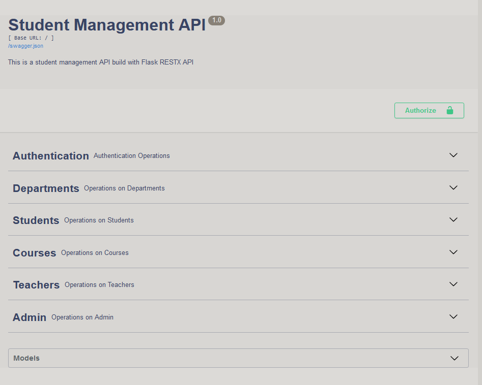
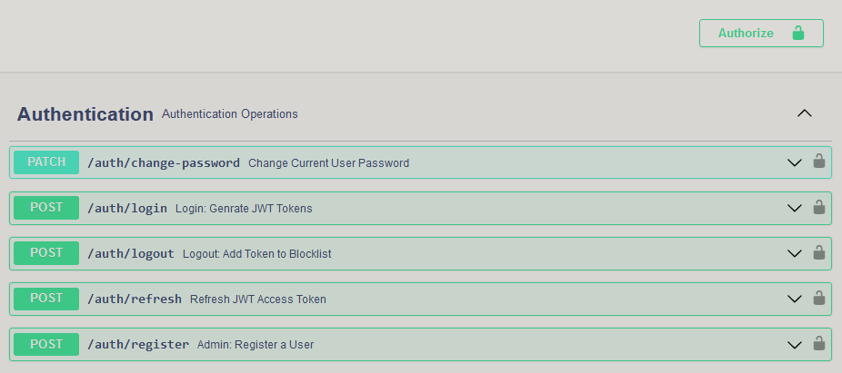
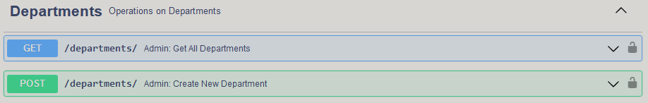
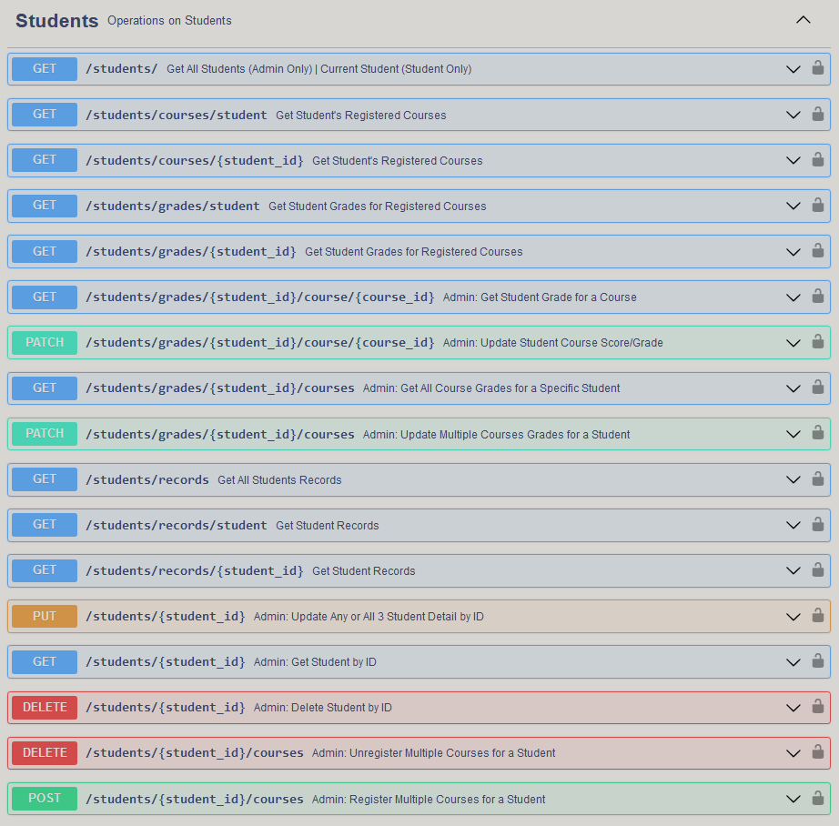
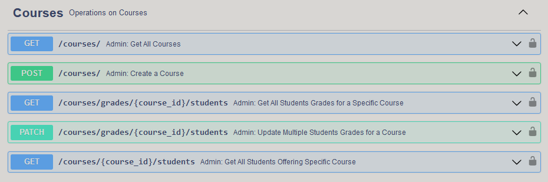
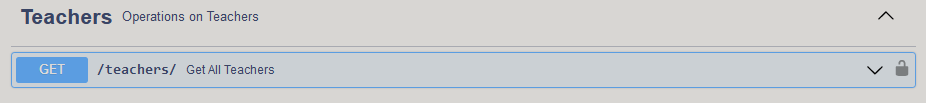
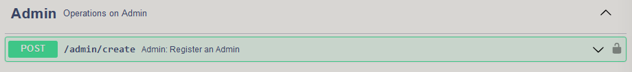
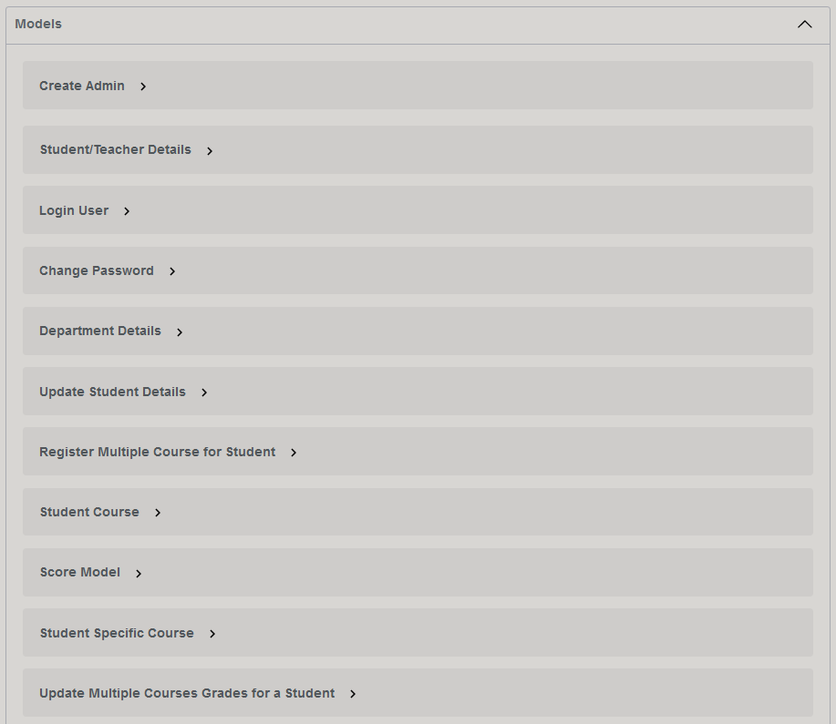
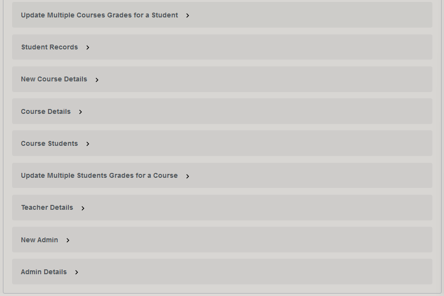

# Student-Management-API (SM-API)

This is a [Student Management API](https://student-management-api.herokuapp.com/) built with Flask RESTX framework in Python.

**Table of Contents**

1. Introduction
2. Project Scope
3. Objective/Application
4. Concepts Applied
5. Knowledge Acquired
6. Try out SM-API
7. Screen Shots
8. License
9. Contact
10. Acknowledgements

## Introduction

This project is a [Student Management API](https://student-management-api.herokuapp.com/) (SM-API) for mainly for registering students, creating dpartments, courses and teachers, as well as handling the grading system for the students.

This was built as my third semester exam project in [AltSchool Africa School of Software Engineering](https://altschoolafrica.com/schools/engineering).

## Project Scope

The SM-API handles the following:

* Student Registration
* Student Dashboard (Views)
* Department Creation
* Course Creation
* Multiple Course Registration for Students
* Teacher Creation
* Teacher Assignment to Courses
* Multiple Student/Course Scoring and Grading
* Functionality to calculate GPA using the 4.0 Grading System.

The future versions will cover more features as needed.

## Objectives/Usage

This SM-API was built to allows school admins to effective manage all matters concerning their students, right from the registering of the students to their final GPA calculations and honours.

Only admins have access to:

* create and retrieve departments.
* create, retrieve, update and delete student data and their credentials as users.
* create courses, teachers and assign teachers for courses.
* register/unregister multiple courses for a specific student at once
* update multiple students' scores and grades for a specific course at once.
* update multiple courses' scores and grades for a specific student at once.
* retrieve all students list, their registered courses, grades and records.
* retrieve all students offering a course and their grades.
* retrieve all student recods, GPA and honurs.

Also the students also have access to login and only view their details, their courses and grades, change passwords and check their overall student records (total courses offered, total credits, total points scored, GPA and honours).

## Concepts Applied

In the SM-API, the following concepts were introduced and used:

* Basic Python Concepts such as variable, functions, ifs and loops.
* Routing and Use of Namespaces
* Database Models and Relationships
* Class Inheritance and Methods
* Database Management and Migrations
* User Authenticaton and Authorization using JWT Tokens
* Using Blocklist for JWT Tokens
* Environment Variables
* Web/Internet Security
* Debugging

## Knowledge Acquired

* Configuration for Development, Test and Production
* Multiple Namespace Route for one Resource Class
* Unit Testing using Pytest and Test Environment Variables
* Use of Flask Shell in Terminal
* Use of Insomnia to test routes.
* Swagger Documentation
* Deployment using Heroku and GitHub

## Try out SM-API

To explore or use the SM-API, do the following:

### How to run it locally on your PC

1. Clone this repository with below command: on your terminal:

```
git clone https://github.com/OSQUAREG/Student-Management-API.git
```

2. CD into the Student-Management-API folder.

   ```
   cd Student-Management-API
   ```
3. Create and activate your virtual environment (for Windows).

   ```
   python -m venv venv
   venv/Scripts/activate (for Windows oS)
   OR
   python -m venv venv
   venv/bin/activate (for Linux or Mac OS)
   ```
4. Pip install all the dependencies in the [requirements.txt](https://github.com/OSQUAREG/Student-Management-API/blob/main/requirements.txt) file:

```
pip install -r requirements.txt
```

5. Go to the [config.py](https://github.com/OSQUAREG/Student-Management-API/blob/main/api/config/config.py) file and under the class ProductionConfig do as instructed in the comments.
6. Create the file called `.env` and set the following environment variables:

* SECRET_KEY="your-super-secret-key"
* JWT_SECRET_KEY="your-super-secret-jwt-key"
* DEFAULT_SUPERADMIN_PASSWORD="superadmin@password"
* DEFAULT_ADMIN_PASSWORD="admin@password"
* DEFAULT_STUDENT_PASSWORD="student@password"
* DEFAULT_TEACHER_PASSWORD="teacher@password"

7. Create tables and also insert the defaults records data:

```
flask shell
create_defaults()
```

    Or simply go to your terminal and use below commands:

```
flask db upgrade 8f7a4337fae1
flask db upgrade 842af2c54d75
```

8. Then run `flask run` to start the server, which give you the localhost address: http://127.0.0.1:5000
9. Copy and paste this in your browser (client-side) and launch it to open the API Swagger interface.
10. You can then log in with the credentials: `email=admin@smapi.com and password=<the DEFAULT_ADMIN_PASSWORD you set>`.

    *Note: for real Production use, this default password should be changed after first login.*
11. Then go ahead to try out the different routes as detailed in the next section: **How to run the deloyed API online**, from Step 3.

### How to run the deployed API online

1. Click the deploy link: [Student Management API](https://student-management-api.herokuapp.com/) or visit: https://student-management-api.herokuapp.com/ on your browser.
2. Click on **Authentication** namespace, and use the `/auth/login` route to generate a JWT Token, using the default admin credentials: `email=admin@sm.com` and `password=admin@paxword` to log in as admin.
   * *Note: for real Production use, this default password should be changed after first login.*
3. Copy the access token generated e.g `eyJhbXVCJ9.eyJbmMzd9.PMrc5-rh_rQh8_tl2V1iDlsl_wAOMHc`
4. Click on any of the padlock icon by the far-right and use the token like this: `Bearer eyJhbXVCJ9.eyJbmMzd9.PMrc5-rh_rQh8_tl2V1iDlsl_wAOMHc`
5. Click **Authorize** and **Close**.
6. Then go to **Admin** namespace, and create your own admin account for proper identification.
7. Go back to Authentication, and use the `auth/logout` route to log out.
8. Then log back in with your credentials.
9. First go to **Departments** and create new department.
10. Go back to **Authentication** and register new users (Students or Teachers) and create new courses as well.
    * ***Note:** For Students, they will be created in the users (having type "student"), students and student records table and given access to log in.*
    * *For Teachers, the will be created in the users (having type "teacher") and teachers table.*
11. Then go ahead to perform other operations like registering students for courses, updating their grades etc.
12. Also log in as a student and try to perform some operations in **Students** namespace that does not require a `student_id` to be passed in to the route URL.

## Screen Shots

Student Management API Swagger UI



Authentication Namespace



Departments Namespace



Students Namespace



Courses Namespace



Teachers Namespace



Admin Namespace



Models (Schemas)





## License

Distributed under the MIT License. See [License](https://github.com/OSQUAREG/Student-Management-API/blob/main/LICENSE) for more information.

## Contacts

You can contact me, Gregory Ogbemudia @OSQUAREG on:

[LinkedIn](https://www.linkedin.com/in/osquareg/) | [Twitter](https://twitter.com/OSQUAREG) | Email: gregory.ogbemudia@gmail.com

## Acknowledgements

* [AltSchool Africa School of Software Engineering](https://altschoolafrica.com/schools/engineering)
* [Caleb Emelike](https://github.com/CalebEmelike)
